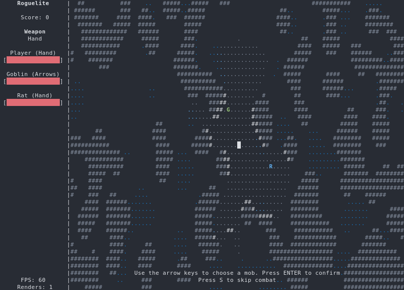

# Roguelite

## Grade: 19/20 :star:

An [ncurses](https://invisible-island.net/ncurses/) roguelite game, made for
our [LI2](https://www4.di.uminho.pt/~jno/sitedi/uc_J302N6.html) class. It is licensed under the
[Apache License](http://www.apache.org/licenses/LICENSE-2.0).

Project requirements (set by the professors) are in `Requirements.pdf` (🇵🇹).



## Building

### Dependencies

 - GNU Make (build-time)
 - GCC (build-time)
 - Bash (build-time)
 - Doxygen (optional, build-time)
 - ncurses

Note that the only supported platform is **Linux** (others \*NIX systems _may_ work) and the only
supported compiler is GCC (clang _may_ work).

### Building

A release build is achieved with:

``` bash
$ make
```

To perform a debug build (no optimizations, debug symbols enabled):

``` bash
$ DEBUG=1 make
```

To generate documentation (Doxygen is required):

``` bash
$ make docs
```

To remove files generated by a build, run:

``` bash
$ make clean
```

## Contributing

As a university group project, we cannot allow external contributors. Our group members should
follow the guidelines in `CONTRIBUTING.md`.
